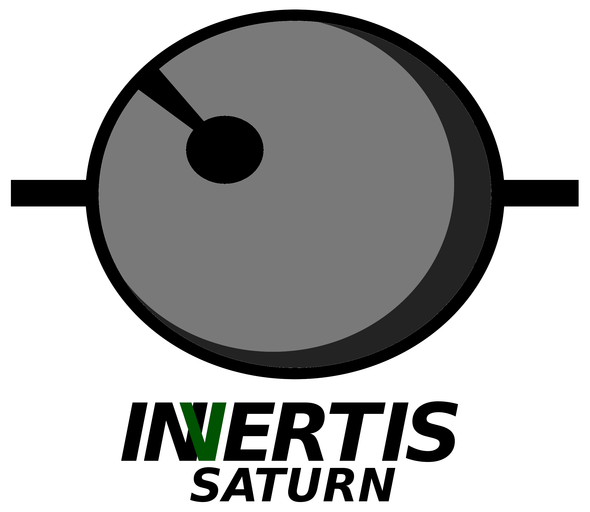

&nbsp;

## INSTALLATION ##

<pre>
git clone https://github.com/pratas/saturn.git
cd saturn/src/
make
</pre>

## ISSUES ##

For any issue let us know at [issues link](https://github.com/pratas/saturn/issues).

## LICENSE ##

GPL v3.

For more information:
<pre>http://www.gnu.org/licenses/gpl-3.0.html</pre>

